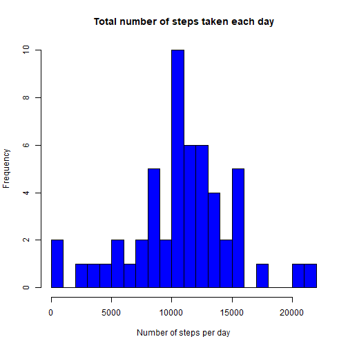
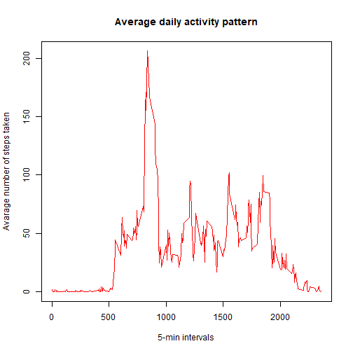
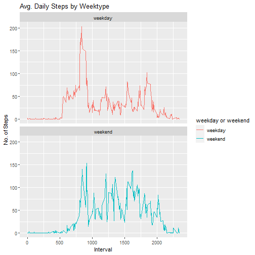

## Loading and preprocessing the data

### It is required that data source file is already in a working directory. I check if the source file is unzipped and if it is not - I unzip it and load the data. Then I delete NA observations, since I do not need it for calculations.


```r
if (!file.exists("activity.csv") ) {
        unzip("activity.zip")
}
raw_data <- read.csv("activity.csv", header = TRUE)
main_data <- na.omit(raw_data)
```

### Then I explore the data with functions ‘str’, ‘head’, ‘tail’, ‘table’ (for each column) in order to get aquianted with it.

## What is mean total number of steps taken per day?


```r
steps_per_day <- aggregate(main_data$steps, by = list(Steps.Date = main_data$date), FUN = "sum")
```

### Then I make a histogram with the frequency ot total numbers


```r
hist(steps_per_day$x, col = "blue", 
     breaks = 20,
     main = "Total number of steps taken each day",
     xlab = "Number of steps per day")
```



### And I calculate the mean and median of the total number of steps


```r
mean_steps <- mean(steps_per_day[,2])
print (mean_steps)
```

```
## [1] 10766.19
```


```r
median_steps <- median(steps_per_day[,2])
print (median_steps)
```

```
## [1] 10765
```

## What is the average daily activity pattern?

### At first, we can look at the plot of the number of steps taken averaged across all days, along all 5-min intervals


```r
avaraged_day <- aggregate(main_data$steps, 
                          by = list(Interval = main_data$interval), 
                          FUN = "mean")
plot(avaraged_day$Interval, avaraged_day$x, col="red",
     type = "l", 
     main = "Average daily activity pattern", 
     ylab = "Avarage number of steps taken", 
     xlab = "5-min intervals")
```



### Then we define the interval with the maximum number of steps


```r
interval_row <- which.max(avaraged_day$x)
max_interval <- avaraged_day[interval_row,1]
print (max_interval)
```

```
## [1] 835
```

## Imputing missing values

### I calculate the total number of NA values in the dataset


```r
NA_number <- length(which(is.na(raw_data$steps)))
print (NA_number)
```

```
## [1] 2304
```

### For substituting NA values I use simple ‘impute’ function in ‘Hmisc’ package (it is implied that this package is installed). I create a new dataset with the missing data filled in.


```r
library(Hmisc)
```

```
## Loading required package: lattice
```

```
## Loading required package: survival
```

```
## Loading required package: Formula
```

```
## Loading required package: ggplot2
```

```
## 
## Attaching package: 'Hmisc'
```

```
## The following objects are masked from 'package:base':
## 
##     format.pval, units
```

```r
raw_data_filled <- raw_data
raw_data_filled$steps <- impute(raw_data$steps, fun=mean)
```

### Then I make histogram with the new frequencies of total number of steps after imputing.


```r
steps_per_day_noNA <- aggregate(raw_data_filled$steps, 
                                by = list(Steps.Date = raw_data_filled$date), 
                                FUN = "sum")
hist(steps_per_day_noNA$x, col = "green", 
     breaks = 20,
     main = "Total number of steps taken each day (filled data)",
     xlab = "Number of steps per day")
```


### And I calculate the new mean and median of the total number of steps after imputing.


```r
mean_steps_noNA <- mean(steps_per_day_noNA[,2])
print (mean_steps_noNA)
```

```
## [1] 10766.19
```


```r
median_steps_noNA <- median(steps_per_day_noNA[,2])
print (median_steps_noNA)
```

```
## [1] 10766.19
```

### As we can see, new figures are almost the same as before filling NA values. The median has changed a bit and became equal to the mean.

## Are there differences in activity patterns between weekdays and weekends?

### 1. Create a new factor variable in the dataset with two levels – “weekday” and “weekend” indicating whether a given date is a weekday or weekend day.


```r
# Just recreating activityDT from scratch then making the new factor variable. (No need to, just want to be clear on what the entire process is.) 
activityDT <- data.table::fread(input = "E:/JOHNS HOPKINS UNIVERSITY/Data Science Specialization/5 Reproducible Research/Week 2/RepData_PeerAssessment1/activity.csv")
activityDT[, date := as.POSIXct(date, format = "%Y-%m-%d")]
activityDT[, `Day of Week`:= weekdays(x = date)]
activityDT[grepl(pattern = "Monday|Tuesday|Wednesday|Thursday|Friday", x = `Day of Week`), "weekday or weekend"] <- "weekday"
activityDT[grepl(pattern = "Saturday|Sunday", x = `Day of Week`), "weekday or weekend"] <- "weekend"
activityDT[, `weekday or weekend` := as.factor(`weekday or weekend`)]
head(activityDT, 10)
```

```
##     steps       date interval Day of Week weekday or weekend
##  1:    NA 2012-10-01        0      Monday            weekday
##  2:    NA 2012-10-01        5      Monday            weekday
##  3:    NA 2012-10-01       10      Monday            weekday
##  4:    NA 2012-10-01       15      Monday            weekday
##  5:    NA 2012-10-01       20      Monday            weekday
##  6:    NA 2012-10-01       25      Monday            weekday
##  7:    NA 2012-10-01       30      Monday            weekday
##  8:    NA 2012-10-01       35      Monday            weekday
##  9:    NA 2012-10-01       40      Monday            weekday
## 10:    NA 2012-10-01       45      Monday            weekday
```

### 2. Make a panel plot containing a time series plot (i.e. 𝚝𝚢𝚙𝚎 = "𝚕") of the 5-minute interval (x-axis) and the average number of steps taken, averaged across all weekday days or weekend days (y-axis). See the README file in the GitHub repository to see an example of what this plot should look like using simulated data.


```r
activityDT[is.na(steps), "steps"] <- activityDT[, c(lapply(.SD, median, na.rm = TRUE)), .SDcols = c("steps")]
IntervalDT <- activityDT[, c(lapply(.SD, mean, na.rm = TRUE)), .SDcols = c("steps"), by = .(interval, `weekday or weekend`)] 
ggplot(IntervalDT , aes(x = interval , y = steps, color=`weekday or weekend`)) + geom_line() + labs(title = "Avg. Daily Steps by Weektype", x = "Interval", y = "No. of Steps") + facet_wrap(~`weekday or weekend` , ncol = 1, nrow=2)
```


